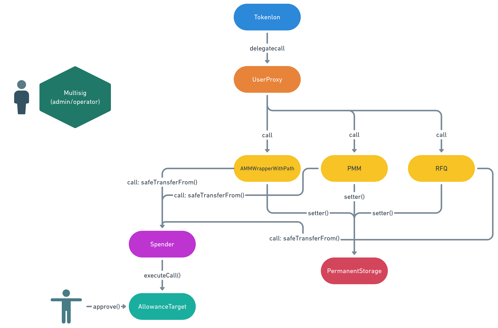

# Tokenlon

Tokenlon is a decentralized exchanging protocol consists of multiple components with a single static entry. Users can trade assets with a quote from a professional market maker or swap with other AMM protocol with no husstle. Also, complex contract interactions can be simplified by leveraging the approval mechanism of the protocol. Tokenlon has its own native token named LON and the protocol is governed by LON token holders. Also, there're other functions in the token economic system which provide incentive for LON token holders and help keeping the protocol sustainable.

There are three major categories of contracts in this repo:

1. [Tokenlon Protocol Infrastructure](#Protocol-Infrastructure)

2. [Strategy Contracts](#Strategy-Contracts)

3. [LON Token Peripherals](#LON-Token-Peripherals)

# Protocol Infrastructure

## UserProxy & Tokenlon

User proxy is the entry of the whole procotol while Tokenlon is a transparent upgradeable proxy of it. User proxy navigate users to a specific strategy contract. Meanwhile, it has a multicall entry which allows batching calls between differnt strategy contracts in a single transaction. Each strategy contract has a corresponding function in `UserProxy` which takes one parameter `bytes _payload` then forward it to the destinated function.

## PermanentStorage & ProxyPermanentStorage

In order to manage global states of upgradeable contracts, a permanaent storage is needed in the system. The storage contract itself is also upgradeable considering the flexibility of storing capabilities. The `ProxyPermanentStorage` contract is a transparent upgradeable proxy and `PermanentStorage` is the logic implementation.

## AllowanceTarget & Spender

Several token approvals are required if a user wants to interact with differnt AMM or other trading protocols. It's important to have an unified token authorizing mechanism in Tokenlon since multiple protocols are involved and most of contracts in the Tokenlon are upgradeable as well. Becuase of that, it takes only one token approval from users to enjoy multiple source of liquidity at the same time. The mechanism is made by two parts. The `AllowanceTarget` contract is the target for users to delegate their tokens while `Spender` contract is the only allowed contract that can move funds. `AllowanceTarget` contract has a general `executeCall()` function which can execute arbitrary operations but only `Spender` contract can call it. It supports updating the address of `Spender` contract by the owner as well.

## SpenderSimulation

`SpenderSimulation` is a contract that simulate the result of `Spender` contract. It allows off-chain servies to verify whether traders have properly approved tokens to `AllowanceTarget` contract without actually execute a complete transaction or consume gas for minded transactions. This contract is made for off-chain executing only.

## MarketMakerProxy

MarketMakerProxy is an example implementation of a EIP-1271 compatable contract wallet. It helps market makers or advanced users to onboard Tokenlon more easily.

# Strategy Contracts

There are multiple strategy contracts in the Tokenlon protocol with different trading mechanisms. A user can navigate to each strategy contract through dedicated routing function in `UserProxy` contract.

-   AMMWrapper & AMMQuoter
-   [RFQ](./strategies/RFQ.md)
-   Limit Order
-   L2Deposit

# LON Token Peripherals

-   LON
-   LON Staking & xLON
-   LPStakingRewards
-   RewardDistributor
-   MerkleRedeem
-   TreasuryVester & TreasuryVesterFactory
